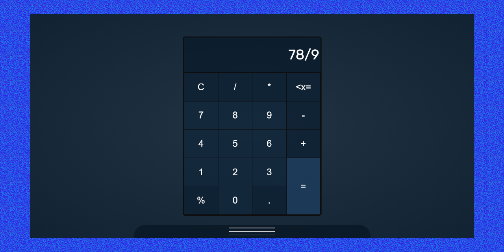
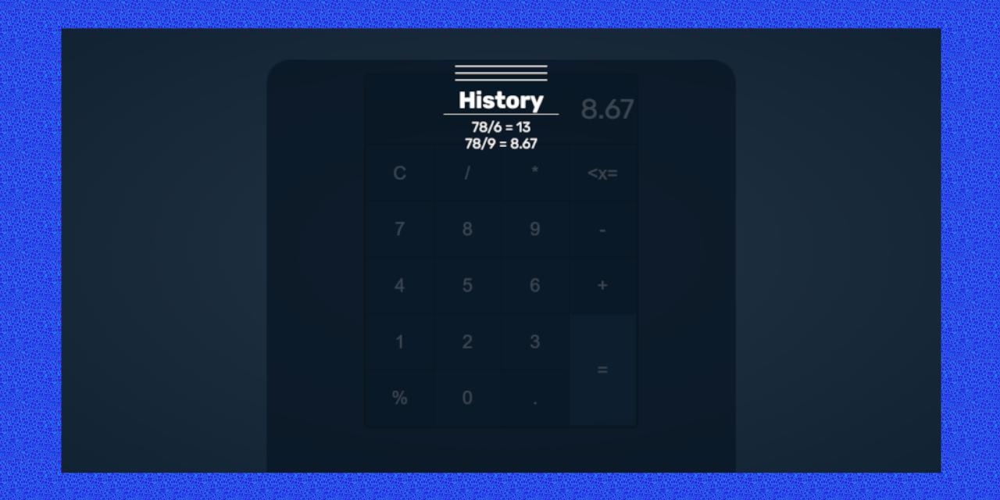

# React Calculator App
> Available on [GitHub Pages](https://krylak123.github.io/react-calculator-app/)

## General info
The purpose of the project is expand a programming knowledge in JavaScript. The app was created in React.

## Screenshots

## Technologies
* React
* SCSS

## Features
* calculation of simple equations
* calculation history

## Status
Project is _finished_
